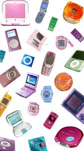

# Y2K Aesthetic

## Overview
The Y2K aesthetic is inspired by early 2000s fashion, pop culture, and technology trends. 
It reflects the optimism and bold styles that were popular during that time.

## Key Features
- Bright colors and metallic fabrics
- Low-rise jeans and crop tops
- Early 2000s pop music
- Playful and futuristic designs

## Why It’s Popular Today
Many teens enjoy the Y2K aesthetic because it feels nostalgic and fun, even for people who did not grow up during that era. 
Social media has helped bring these trends back into popularity.

## Learn More
- [Y2K Fashion (Wikipedia)](https://en.wikipedia.org/wiki/2000s_fashion)

